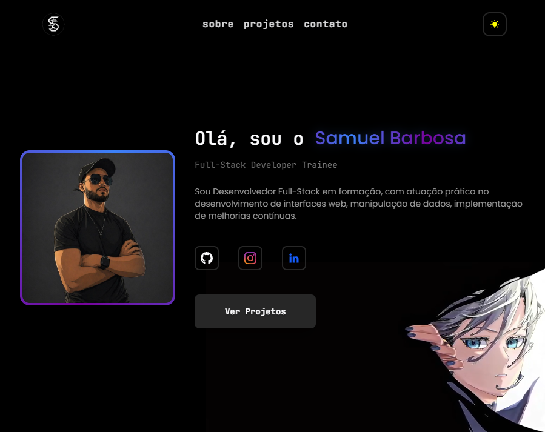

# 👨‍💻 Samuel Barbosa

<div align="center">

### Full-Stack Developer Trainee

Construindo experiências digitais modernas, performáticas e centradas no usuário.

<br>

[🌐 Portfólio](https://samuelbabosadev.vercel.app/) •
[💼 LinkedIn](https://www.linkedin.com/in/samuel-miguel-barbosa/) •
[📷 Instagram](https://www.instagram.com/_samuks11/) •
[🐙 GitHub](https://github.com/SamuelBarbosa11)

</div>

---

## ✨ Sobre o Projeto

Este portfólio foi desenvolvido para apresentar meus projetos, habilidades técnicas e trajetória como desenvolvedor Full-Stack.

O foco principal foi criar uma experiência visual moderna, responsiva e agradável, utilizando animações suaves, tema claro/escuro e boas práticas de desenvolvimento frontend e backend.

---

## 🚀 Tecnologias Utilizadas

### Frontend

* React
* Vite
* Tailwind CSS
* JavaScript (ES6+)

### Backend & Infra

* Firebase Firestore

* Firebase Admin SDK

* Static Site Generation (SSG)

* Vercel

### Ferramentas

* Git
* GitHub
* VS Code

---

## 🎨 Funcionalidades

✔️ Tema claro e escuro

✔️ Animações de entrada suaves

✔️ Efeito de texto progressivo

✔️ Galeria de projetos responsiva

✔️ Layout adaptado para dispositivos móveis

✔️ Dados estáticos gerados automaticamente

✔️ Carregamento otimizado via JSON

✔️ Cache nativo do navegador

✔️ Baixíssimo consumo do Firestore

✔️ Estrutura preparada para CDN

---

## 📸 Preview

<p align="center">
  
</p>

---

## 📂 Estrutura do Projeto

```text
.
├── public/
│   ├── projects.json
│   └── skills.json
│
├── scripts/
│   ├── config/
│   ├── lib/
│   └── exportCollections.js
│
├── src/
│   ├── assets/
│   ├── components/
│   ├── contexts/
│   ├── hooks/
│   ├── sections/
│   ├── styles/
│   └── utils/
│
└── vite.config.js
```

---

## ⚙️ Executando Localmente

Clone o projeto:

```bash
git clone https://github.com/SamuelBarbosa11/Portifolio-Samuel-Barbosa.git
```

Entre na pasta:

```bash
cd Portifolio-Samuel-Barbosa
```

Instale as dependências:

```bash
npm install
```

Execute:

```bash
npm run dev:full
```

Caso apenas esteja desenvolvendo a interface (React),
não é necessário executar o exportCollections.js.

Execute o script apenas quando alterar os dados do Firestore
ou antes de gerar um build de produção.

### Requisitos para desenvolvimento

Para que o script de exportação funcione localmente, crie o arquivo:

scripts/config/serviceAccount.local.json

contendo a chave privada de uma Service Account do Firebase.

Essa chave pode ser obtida em:

Firebase Console

→ Configurações do Projeto

→ Service Accounts

→ Generate New Private Key

## 📦 Arquitetura dos Dados

O portfólio não realiza consultas diretas ao Firestore em produção.

Durante o processo de build, um script utiliza o Firebase Admin SDK para exportar automaticamente as coleções do banco para arquivos JSON estáticos (ex: `projects.json` e `skills.json`).

A aplicação React consome apenas esses arquivos, proporcionando:

- menor tempo de carregamento;
- cache eficiente pelo navegador;
- redução drástica das leituras do Firestore;
- isolamento da camada de dados do cliente;
- preparação para distribuição por CDN.

## 👨‍💻 Autor

Samuel Barbosa

Desenvolvedor Full-Stack em formação apaixonado por tecnologia, design e construção de experiências digitais modernas.

---

<div align="center">

### ⭐ Se gostou do projeto, considere deixar uma estrela no repositório.

</div>
